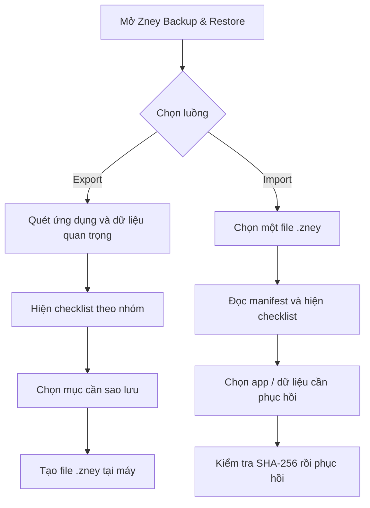
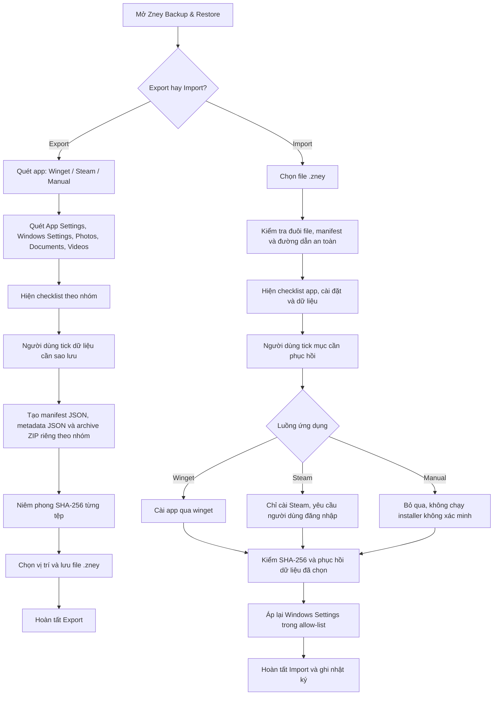

# Zney Backup & Restore

[](https://github.com/psy-zney/BackupData/actions/workflows/build-msi.yml)
[](https://github.com/psy-zney/BackupData/releases)

Ứng dụng Windows giúp sao lưu dữ liệu cá nhân, cấu hình ứng dụng và một tập cài đặt Windows an toàn trước khi cài lại máy hoặc chuyển máy. Zney tạo và chỉ đọc định dạng `.zney`; không chạy script từ file backup.

## Tải và cài đặt

Tải `ZneyBackup.msi` từ [GitHub Releases](https://github.com/psy-zney/BackupData/releases/latest), cài đặt, sau đó mở **Zney Backup & Restore** từ Start Menu hoặc thư mục cài đặt.

Khi gỡ cài đặt, MSI chỉ dọn `%LOCALAPPDATA%\ZneyBackup` — cache riêng của Zney. File `.zney`, Documents, Photos, Videos, Steam và dữ liệu ứng dụng khác luôn được giữ nguyên.

## Luồng sử dụng



### Export

1. Chọn **Export — Quét và tạo backup .zney**.
2. Chờ Zney quét ứng dụng và các thư mục được hỗ trợ.
3. Tick đúng dữ liệu cần sao lưu.
4. Chọn vị trí lưu; thư mục mặc định là `Documents\Zney Backups`.
5. Zney tạo một file `.zney` duy nhất.

### Import

1. Chọn **Import — Chọn file .zney để phục hồi**.
2. Chỉ định file `.zney` đã tạo bởi Zney.
3. Kiểm tra checklist, bỏ chọn mọi mục không mong muốn.
4. Bấm phục hồi. Mỗi file được kiểm SHA-256 trước khi ghi đè.

> Đóng Chrome, Edge, VS Code và các ứng dụng liên quan trước khi Export để tránh file bị khóa hoặc chưa kịp ghi xuống đĩa.

## Dữ liệu được hỗ trợ

| Nhóm | Bao gồm | Mặc định |
| --- | --- | --- |
| `ApplicationSettings` | VS Code, Chrome, Edge, Git, Windows Terminal | Chọn |
| `WindowsSettings` | Explorer, theme, transparency, taskbar alignment | Chọn |
| `Photos` | Pictures | Không chọn |
| `Documents` | Documents | Không chọn |
| `Videos` | Videos | Không chọn |

Photos, Documents và Videos được nhận diện nhưng không tự tick vì có thể rất lớn. Hãy sao lưu thử nhóm nhỏ trước khi sao lưu toàn bộ dữ liệu media.

## Phục hồi ứng dụng

| Luồng | Hành vi |
| --- | --- |
| `Winget` | Cài tự động bằng package ID đã lưu. |
| `Steam` | Cài Steam qua `Valve.Steam`, sau đó người dùng tự mở Steam, đăng nhập và quản lý game. Zney không lưu đăng nhập hoặc tự tải game. |
| `Manual` | Không có nguồn cài đáng tin cậy; chỉ hiển thị thông tin và bỏ qua. |

## Định dạng `.zney`

`.zney` là ZIP container riêng của Zney. Mỗi nhóm dữ liệu có archive nén độc lập; JSON lưu metadata/cài đặt; manifest giữ hash từng file.

```text
manifest.json
metadata/
  apps.json
  data-groups.json
settings/
  application-settings.json
  windows-settings.json
archives/
  VS_Code_settings.zip
  Personal_documents.zip
  Personal_photos.zip
```

Zney chặn Zip Slip, giới hạn dung lượng giải nén và chỉ phục hồi về vùng dữ liệu người dùng cho phép. Chỉ mở file `.zney` mà bạn tin cậy.

## Workflow hoạt động trong app



Các điểm kiểm soát của người dùng nằm ở hai checklist: trước khi tạo `.zney` và trước khi phục hồi. Zney không tự tải game Steam, không tự chạy script, không tự chọn ảnh/tài liệu/video dung lượng lớn.

## Kiểm thử

Pipeline chạy các test lõi sau trước khi đóng gói:

- Tạo `.zney`, đọc manifest và khôi phục file.
- Phát hiện archive bị sửa bằng SHA-256 trước khi ghi đè.
- Chặn đường dẫn Zip Slip.

UI, đăng nhập Steam và profile trình duyệt cần kiểm thử thủ công trên Windows tương tác. Khuyến nghị thử với một thư mục cấu hình nhỏ hoặc tài khoản Windows phụ trước khi dùng cho dữ liệu quan trọng.

## Giới hạn bảo mật có chủ đích

- Không sao lưu mật khẩu, token đăng nhập hay khóa riêng.
- Không tự chạy installer không xác minh hoặc script trong backup.
- SHA-256 phát hiện thay đổi dữ liệu nhưng không thay thế chữ ký số; luôn chỉ dùng backup từ nguồn tin cậy.
