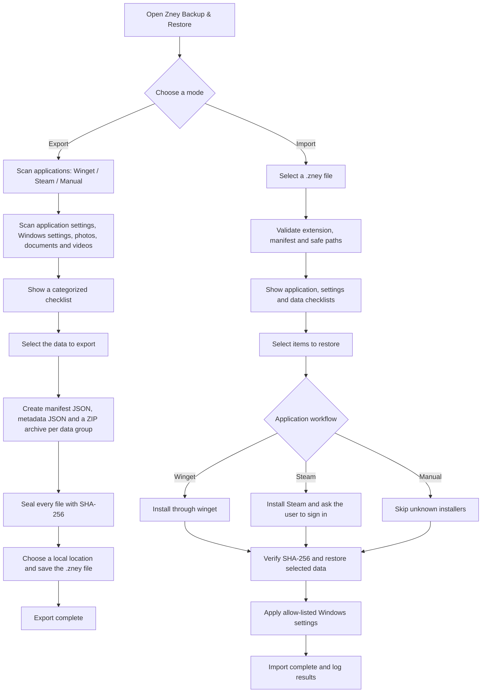

# Zney Backup & Restore

[](https://github.com/psy-zney/BackupData/actions/workflows/build-msi.yml)
[](https://github.com/psy-zney/BackupData/releases)

Zney Backup & Restore is a Windows application for preparing a PC before a Windows reinstall or migration. It backs up selected personal data, application configuration, and a small allow-listed set of Windows preferences into a single `.zney` package.

Zney creates and reads `.zney` files only. It never runs scripts from a backup package.

## Download and install

Download `ZneyBackup.msi` from [GitHub Releases](https://github.com/psy-zney/BackupData/releases/latest) and install it. Zney Backup & Restore opens when installation finishes. Desktop and Start menu shortcuts are also created for later use.

Uninstalling removes only Zney's internal cache at `%LOCALAPPDATA%\ZneyBackup`. It never removes `.zney` backups, Documents, Photos, Videos, Steam data, or third-party application data.

## Visual Studio 2022 debugging

Open `BackupUtility.sln`, select **BackupUtility** as the Startup Project, choose the **Debug** configuration, then press `F5`. The included launch profile uses the WPF project directly. Administrator mode is not required for the Registry-first scan; protected keys are skipped safely.

## Scan order and responsiveness

The export scan is intentionally bounded and does not enumerate the entire disk:

- Desktop and Start Menu shortcuts are read first.
- Installed apps are then read from the current-user Registry, 32-bit (x86) uninstall view, and 64-bit uninstall view.
- `winget` is optional, runs in the background, is stopped after 35 seconds if it does not finish, and is cached for 12 hours after a successful scan.
- Data locations are listed from metadata immediately. Their files are traversed once, as a stream, only when the user creates the backup; inaccessible paths and reparse points are skipped.

## Language

The application starts in **English**. Use the language selector in the top-right corner to switch to **Tiếng Việt** without restarting the application. The main navigation, buttons, labels, and workflow screen update immediately.

## Application workflow



## Export

1. Choose **Export — Scan and create a .zney backup**.
2. Zney scans supported applications and data groups.
3. Review the checklist and select only the items you want.
4. Choose a save location. The default folder is `Documents\Zney Backups`.
5. Zney creates one `.zney` file on your computer.

Close Chrome, Edge, VS Code, and related applications before exporting their profiles so files are not locked or left unwritten.

## Import

1. Choose **Import — Select a .zney file to restore**.
2. Select a `.zney` package created by Zney.
3. Review every application and data group; clear any item you do not want to restore.
4. Start import. Files are verified with SHA-256 before they can overwrite local files.

## Data groups

| Group | Included data | Default selection |
| --- | --- | --- |
| `ApplicationSettings` | VS Code, Chrome, Edge, Git, Windows Terminal | Selected |
| `WindowsSettings` | Explorer, light/dark theme, transparency, taskbar alignment | Selected |
| `Photos` | Pictures folder | Not selected |
| `Documents` | Documents folder | Not selected |
| `Videos` | Videos folder | Not selected |

Photos, Documents, and Videos are detected but not selected automatically because they can be very large. Test with a small data set before exporting an entire media library.

## Application restore behavior

| Workflow | Behavior |
| --- | --- |
| `Winget` | Installs automatically with the saved package ID. |
| `Steam` | Installs Steam using `Valve.Steam`, then stops so the user can open Steam, sign in, and manage games. Zney does not store credentials or download games. |
| `Manual` | Has no trusted installer source. Zney displays the entry and skips automatic installation. |

## `.zney` package layout

`.zney` is a Zney-specific ZIP container. Each data group has its own compressed archive; JSON files hold metadata and settings; the manifest stores a hash for every backed-up file.

```text
manifest.json
metadata/
  apps.json
  data-groups.json
settings/
  application-settings.json
  windows-settings.json
archives/
  VS_Code_settings.zip
  Personal_documents.zip
  Personal_photos.zip
```

Zney blocks Zip Slip paths, enforces an extraction-size limit, and restores only to permitted user-data locations. Open `.zney` files only from sources you trust.

## Validation and releases

Every push to `master` runs the GitHub Actions workflow in [`.github/workflows/build-msi.yml`](.github/workflows/build-msi.yml). It runs automated integrity tests, publishes a self-contained Windows x64 app, and creates an MSI. A `v*` tag additionally creates a GitHub Release and attaches the MSI.

Automated tests cover:

- Creating a `.zney`, reading its manifest, and restoring a file.
- Detecting a modified archive with SHA-256 before overwrite.
- Blocking Zip Slip paths.

The desktop UI, Steam sign-in, and real browser profiles require manual testing on an interactive Windows machine. Use a secondary Windows account or a small test data set before restoring important data.

## Security boundaries

- Zney does not back up passwords, sign-in tokens, or private keys.
- Zney does not execute backup scripts or unverified installers.
- SHA-256 detects modified archive contents but is not a replacement for a digital signature. Only import backups you trust.
